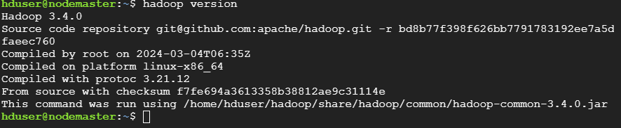
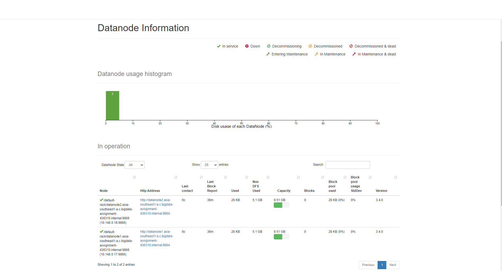

# Install Hadoop 3 node cluster on Google Cloud Platform (GCP)
Here is a step-by-step guide to install a 3-node Hadoop cluster on Google Cloud Platform (GCP). The cluster consists of 1 master node and 2 slave nodes. The masternode will run the NameNode and ResourceManager services, while the datanode will run the DataNode and NodeManager services. The Hadoop version used in this guide is 3.4.0.

## Intialize the VMs on GCP
1. Click on **Navigation Menu** > **Compute Engine** > **VM Instances**
2. Click on **Create Instance** and create 3 VMs with the following configurations:
    - **Name**: nodemaster
    - **Region**: asia-southeast1
    - **Machine type**: e2-standard-2 (2 vCPUs, 8 GB memory)
    - **Boot disk**: Ubuntu 20.04 LTS
    - **Firewall**: Allow HTTP traffic, Allow HTTPS traffic
3. Repeat the above step to create 2 more VMs with the following configurations:
    - **datanode1**
    - **datanode2**  


<p style="text-align:center;"><strong>Figure 1</strong>: 3 VMs created on GCP </p>

##  Install dependencies on each node
In ```masternode``` and ```datanode```
1. Open a terminal and run with root:
```bash
sudo -i
```

2. Update the package list and install the dependencies:
```bash
apt-get update
```

3. Create a new user and add it to the sudo group:
```bash
adduser hduser
```

## Configure the VMs
In ```nodemaster``` and ```datanode```
- Configure the SSH key for the hadoop user on each node
```bash
vi /etc/ssh/sshd_config
```
* Change the following lines in the sshd_config file:
```plaintext
PasswordAuthentication yes
ChallengeResponseAuthentication yes
```
* Restart the ssh service:
```bash
service sshd restart
```

- Create Host File on each node, edit ```/etc/hosts``` file on each node and add the following entries:
```plaintext
File: /etc/hosts

10.148.0.16 nodemaster.asia-southeast1-a.c.bigdata-assignment-436310.internal
10.148.0.17 datanode1.asia-southeast1-a.c.bigdata-assignment-436310.internal
10.148.0.18 datanode2.asia-southeast1-a.c.bigdata-assignment-436310.internal
```

## Install Java on each node
In ```nodemaster``` and ```datanode```
- Install Java JDK and JRE on each node:
```bash
apt install default-jdk default-jre -y
```
- Check the Java version:
```bash
java --version
```
You should see the following output:
```plaintext
openjdk 11.0.18 2023-01-17
OpenJDK Runtime Environment (build 11.0.18+10-post-Ubuntu-0ubuntu122.04)
OpenJDK 64-Bit Server VM (build 11.0.18+10-post-Ubuntu-0ubuntu122.04, mixed mode, sharing)
``` 

- Check Java location on each node:
```bash
dirname $(dirname $(readlink -f $(which java)))
```

You should see the following output:
```plaintext
/usr/lib/jvm/java-11-openjdk-amd64
```

## Configure SSH on each node
On the ```nodemaster```:
- Switch the user to Hadhoop and generate the SSH key:
```bash
su - hduser
ssh-keygen -t rsa
```

**You should see the following output on the following screen:**


- Append the public key to the authorized_keys file:
```bash
cat ~/.ssh/id_rsa.pub >> ~/.ssh/authorized_keys
```

- Grant access to the authorized_keys file:
```bash
chmod 700 ~/.ssh
chmod 600 ~/.ssh/authorized_keys
```

- Copy the SSH key to the datanode1 and datanode2:
```bash
ssh-copy-id hduser@datanode1
ssh-copy-id hduser@datanode2
```

## Install Hadoop on the all nodes
Download Hadoop 3.4.0 from the official website:
```bash
wget https://downloads.apache.org/hadoop/common/hadoop-3.4.0/hadoop-3.4.0.tar.gz
```

Extract the Hadoop tar file:
```bash
tar -xvzf hadoop-3.4.0.tar.gz
```

Rename the Hadoop directory:
```bash
mv hadoop-3.4.0 hadoop
```

Edit the **~/.bashrc** file and add the Hadoop environment variables.
```bash
nano ~/.bashrc
```
Add the following lines.
```plaintext
export JAVA_HOME=/usr/lib/jvm/java-11-openjdk-amd64
export HADOOP_HOME=/home/hduser/hadoop
export HADOOP_INSTALL=$HADOOP_HOME
export HADOOP_MAPRED_HOME=$HADOOP_HOME
export HADOOP_COMMON_HOME=$HADOOP_HOME
export HADOOP_HDFS_HOME=$HADOOP_HOME
export HADOOP_YARN_HOME=$HADOOP_HOME
export HADOOP_COMMON_LIB_NATIVE_DIR=$HADOOP_HOME/lib/native
export PATH=$PATH:$HADOOP_HOME/sbin:$HADOOP_HOME/bin
export HADOOP_OPTS="-Djava.library.path=$HADOOP_HOME/lib/native"
```
Activate the changes:
```bash
source ~/.bashrc
```
Verify the Hadoop installation:
```bash
hadoop version
```
**You should see the following output:**


## Configure Apache Hadoop Cluster
Edit the Hadoop enviroment variable file on all nodes and define JAVA_HOME:
```bash
nano $HADOOP_HOME/etc/hadoop/hadoop-env.sh
```

Change the following line:
```plaintext
export JAVA_HOME=/usr/lib/jvm/java-11-openjdk-amd64
```

On the ```nodemaster```, create a nodename and datanode directory:
```bash
mkdir -p ~/hadoopdata/hdfs/{namenode,datanode}
```

Edit the ```core-site.xml``` file on the ```nodemaster``` and define system hostname:
```bash
nano $HADOOP_HOME/etc/hadoop/core-site.xml
```

Change the following lines:
```plaintext
<configuration>
<property>
<name>fs.defaultFS</name>
<value>hdfs://masternode:9000</value>
</property>
</configuration>
```

Then, edit the ```hdfs-site.xml``` file on the ```nodemaster``` and define the namenode and datanode directory:
```bash
nano $HADOOP_HOME/etc/hadoop/hdfs-site.xml
```

Change the following lines:
```plaintext
<configuration>
<property>
<name>dfs.replication</name>
<value>2</value>
</property>

<property>
<name>dfs.name.dir</name>
<value>file:///home/hduser/hadoopdata/hdfs/namenode</value>
</property>

<property>
<name>dfs.data.dir</name>
<value>file:///home/hduser/hadoopdata/hdfs/datanode</value>
</property>
</configuration>
```

Now, edit the workers file on the ```nodemaster``` and define the datanode:
```bash
nano $HADOOP_HOME/etc/hadoop/workers
```

Add the following line:
```plaintext
datanode1
datanode2
```

Copy the Hadoop configuration files to the datanode1 and datanode2:
```bash
scp $HADOOP_HOME/etc/hadoop/* hduser@datanode1:$HADOOP_HOME/etc/hadoop/
scp $HADOOP_HOME/etc/hadoop/* hduser@datanode2:$HADOOP_HOME/etc/hadoop/
```

## Format Namenode and Start Hadoop
On the ```nodemaster```, format the Hadoop namenode:
```bash
hdfs namenode -format
```

**Once the namenode is formatted, you should see the following output:**


Next, start Hadoop DFS services:
```bash
start-dfs.sh
```

You should see the following output:
```plaintext
Starting namenodes on [masternode]
Starting datanodes
Starting secondary namenodes [masternode]
```

Next, run the following command to verify the Hadoop cluster on the ```nodemaster```:
```bash
jps
```

**You should see the following output**: <br>


Now, run the following command to verify the Hadoop cluster on the ```datanode1``` and ```datanode2```:
```bash
jps
```
**You should see the following output**: <br>


To stop the Hadoop cluster, run the following command on the ```nodemaster```:
```bash
stop-dfs.sh
```

Next, edit the **yarn-site.xml** file on both datanode
```bash
nano $HADOOP_HOME/etc/hadoop/yarn-site.xml
```

Define the ```nodemaster``` hostname:
```plaintext
<property>
<name>yarn.resourcemanager.hostname</name>
<value>masternode</value>
</property>
```

## Create firewall rules on GCP
1. **Click on nodemaster** 

2. **Roll down to the bottom of the page and find Network interfaces and click default in network**

3. **Click on button FIREWALLS, click vpc-firewall-rules, Choose default-allow-http**

4. Edit in tcp run from port 0-6000, can be any port you want


## Monitor Hadoop Cluster
1. You can get useful information about the Hadoop cluster with ```hdfs dfsadmin``` command:
```bash
hdfs dfsadmin -report
```

2. You can also monitor the Hadoop cluster with the Hadoop web interface. Open a web browser and enter the following URL:
```plaintext
http://34.142.181.153:9870  
```
**Note**:
- On the GCP, you need to create a firewall rule to allow the traffic on port 9870 and 8088.
- Replace the IP address with the external IP address of the nodemaster.

The following screenshot shows the Hadoop web interface:


## Put and Get Data from HDFS
Writing and reading to HDFS is done with command ```hdfs dfs```.
```bash
hdfs dfs -mkdir -p /user/hduser
```

Let's put a file to HDFS:
1. Create a books directory in HDFS:
```bash
hdfs dfs -mkdir books
```
2. Grab a few books from the Gutenberg project:
```bash
cd /home/hduser
wget -O alice.txt https://www.gutenberg.org/files/11/11-0.txt
wget -O holmes.txt https://www.gutenberg.org/files/1661/1661-0.txt
wget -O frankenstein.txt https://www.gutenberg.org/files/84/84-0.txt
```
3. Put the books to the HDFS:
```bash
hdfs dfs -put alice.txt holmes.txt frankenstein.txt books
```
4. List the content of the books directory:
```bash
hdfs dfs -ls books
```
5. Get the book from the HDFS:
```bash
hdfs dfs -get books/alice.txt
```
6. Directly read the content of the book from the HDFS:
```bash
hdfs dfs -cat books/alice.txt
```

## Run YARN
### Start and Stop YARN
1. Start YARN with the script:
```bash
start-yarn.sh
```

2. Stop YARN with the script:
```bash
stop-yarn.sh
```

### Monitor YARN
1. Can monitor the YARN with the following command:
```bash
yarn node -list
```
Similarly, you can get a list of running applications with the following command:
```bash
yarn application -list
```

2.Web interface for YARN:
```plaintext
http://34.142.181.153/:8088
```


## Submit a MapReduce Job to YARN
**On the ```nodemaster```, run**:
```bash
yarn jar ~/hadoop/share/hadoop/mapreduce/hadoop-mapreduce-examples-3.1.2.jar wordcount "books/*" output
```

2. After the job is completed, you can check the output with the following command:
```bash
hdfs dfs -ls output
```

3. Print the output:
```bash
hdfs dfs -cat output/part-r-00000 | less
```